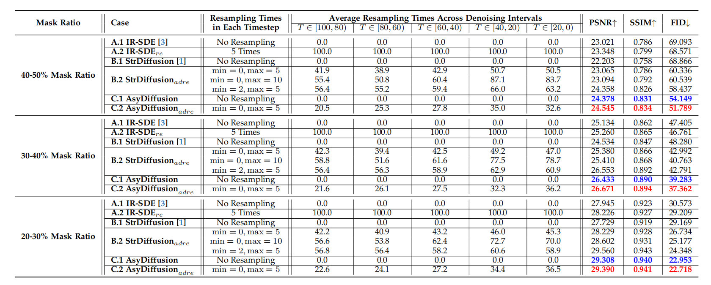
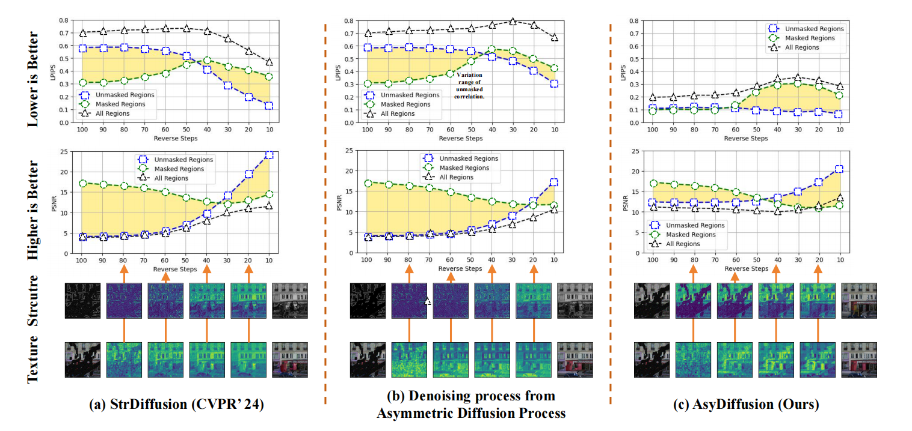
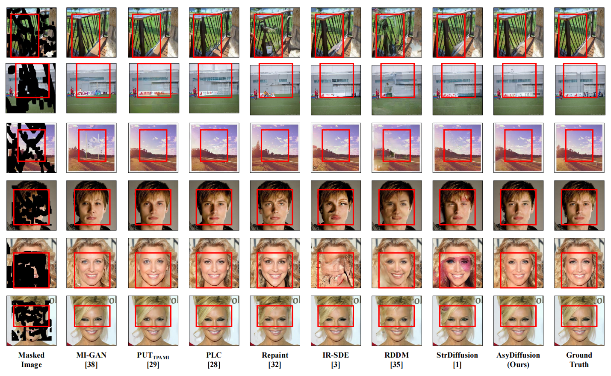

# AsyDiffusion


#
## Dependencies

* OS: Ubuntu 20.04.6
* nvidia :
	- cuda: 12.3
	- cudnn: 8.5.0
* python3
* pytorch >= 1.13.0
* Python packages: `pip install -r requirements.txt`

## Train-[Structure Denoising Model]
1. Dataset Preparation:
   
   Download mask and image datasets, then get into the `AsyDiffusion/train/structure` directory and modify the dataset paths in option files in `/config/inpainting/options/train/ir-sde.yml`
   * *You can set the mask path in [here](https://github.com/htyjers/StrDiffusion/blob/5749a214bb39754be165fa2bf76f96f13bc3e4a3/train/structure/config/inpainting/options/train/ir-sde.yml#L15)*
   * *You can set the image path in [here](https://github.com/htyjers/StrDiffusion/blob/5749a214bb39754be165fa2bf76f96f13bc3e4a3/train/structure/config/inpainting/options/train/ir-sde.yml#L22)*

2. Run the following command:
```
Python3 ./train/structure/config/inpainting/train.py
```

## Train-[Texture Denoising Model]
1. Dataset Preparation:
   
   Download mask and image datasets, then get into the `AsyDiffusion/train/texture` directory and modify the dataset paths in option files in `/config/inpainting/options/train/ir-sde.yml`
   * *You can set the mask path in [here](https://github.com/htyjers/AsyDiffusion/blob/5749a214bb39754be165fa2bf76f96f13bc3e4a3/train/texture/config/inpainting/options/train/ir-sde.yml#L15)*
   * *You can set the image path in [here](https://github.com/htyjers/AsyDiffusion/blob/5749a214bb39754be165fa2bf76f96f13bc3e4a3/train/texture/config/inpainting/options/train/ir-sde.yml#L22)*

2. Run the following command:
```
Python3 ./train/texture/config/inpainting/train.py
```


## Test-[AsyDiffusion]
1. Dataset Preparation:

   Download mask and image datasets, then get into the `AsyDiffusion/test/texture` directory and modify the dataset paths in option files in `/config/inpainting/options/test/ir-sde.yml`
   * *You can set the mask path in [here](https://github.com/htyjers/StrDiffusion/blob/5749a214bb39754be165fa2bf76f96f13bc3e4a3/test/texture/config/inpainting/options/test/ir-sde.yml#L15)*
   * *You can set the image path in [here](https://github.com/htyjers/StrDiffusion/blob/5749a214bb39754be165fa2bf76f96f13bc3e4a3/test/texture/config/inpainting/options/test/ir-sde.yml#L23)*
     
2. Pre-trained models:
   
   Download the pre-trained model, then get into the `AsyDiffusion/test/texture` directory and modify the model paths in option files in `/config/inpainting/options/test/ir-sde.yml`
   * *You can set the path of Texture Denoising Model in [here](https://github.com/htyjers/StrDiffusion/blob/5749a214bb39754be165fa2bf76f96f13bc3e4a3/test/texture/config/inpainting/options/test/ir-sde.yml#L44)*
   * *You can set the path of Structure Denoising Model in [here](https://github.com/htyjers/StrDiffusion/blob/5749a214bb39754be165fa2bf76f96f13bc3e4a3/test/texture/config/inpainting/options/test/ir-sde.yml#L45)*
    
3. Run the following command:
```
Python3 ./test/texture/config/inpainting/test.py
```

#
## Example Results

- Ablation study about the affect of resampling strategy under varied mask on the PSV dataset. The best results are in red, and the second-best results are in blue. The results show our AsyDiffusion with neither resampling nor discriminator outperforms the existing resampling models by merely resorting to diffusion model for image inpainting.




- Illustration of the motivating experiments about how to develop the model that focuses on the diffusion model to address the discrepancy of structure-texture correlation between masked and unmasked regions




- Visual comparison between our method and the competitors.



